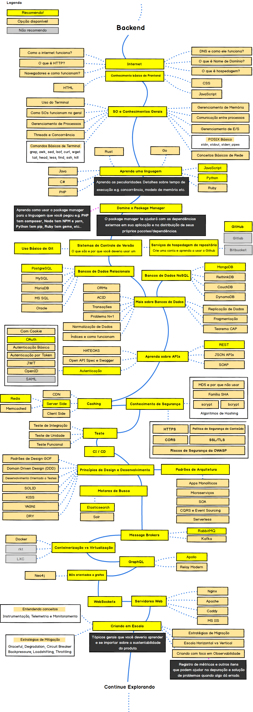

# Estudos Backend

Este repositório foi criado por mim com o objetivo de construir uma base sólida em desenvolvimento backend. Aqui, armazenarei os conhecimentos adquiridos, abrangendo todos os aspectos necessários para o desenvolvimento de soluções eficientes e modernas nessa área desde o básico até o avançado. Usarei como base para essa jornada como guia a trilha desenvolvida pela [comunidade](https://github.com/arthurspk/guiadobackend):

# Sumário

1. [Descrição](#descrição)
2. [Dominio](#dominio)
3. [Distintivos](#distintivos)
4. [Visuais](#visuais)
5. [Estrutura do Projeto](#estrutura-do-projeto)
6. [Plataformas Utilizadas para Aprendizado](#plataformas-utilizadas-para-aprendizado)
7. [Ferramentas Utilizadas](#ferramentas-utilizadas)
8. [Autores e Reconhecimento](#autores-e-reconhecimento)
9. [Licença](#licença)
10. [Status do Projeto](#status-do-projeto)

# Descrição

Este repositório é uma iniciativa para que eu possa criar de fato um histórico concreto das tecnologias que eu domino e utilizo no meu dia-a-dia. Ou seja, aqui está centralizado tudo que eu domino em relação a desenvolvimento backend.

A forma como este repositório está organizado facilita a utilização dos projetos desenvolvidos como base para demonstrar as tecnologias nas quais possuo expertise.

# Dominio

O gráfico a seguir exibe de forma macro minha auto avaliação em relação ao domínio das linguagens e frameworks que estudei e armazenei neste repositório.

# Distintivos

# Visuais

# Estrutura do Projeto

Este repositório está organizado da seguinte forma:

# Plataformas Utilizadas para Aprendizado

# Ferramentas Utilizadas

# Autores e Reconhecimento

Atualmente, estou reforçando meu conhecimento, revisitando conceitos e práticas para garantir um domínio completo dessas tecnologias. Apesar da minha ampla experiência, estou me dedicando a este esforço pessoalmente para assegurar a excelência e compreensão.

Gostaria de expressar minha gratidão a todos que contribuíram para a construção deste conhecimento, incluindo professores da faculdade e outros mentores ao longo do caminho.

# Licença

[GAMELEIRA STUDY](LICENSE.md)

# Status do Projeto

O projeto está **ativo** e em constante **desenvolvimento**!

Essa repositório começou em **20 de junho de 2024** com o objetivo de desenvolver um conhecimento sólido sobre as tecnologias essenciais e principios para o desenvolvimento frontend. Planejo alcançar essa meta até **31 de dezembro de 2034**. Para isso realizarei estudos em plataformas web, cursos e graduações presenciais e a distancia para construir esse projeto.